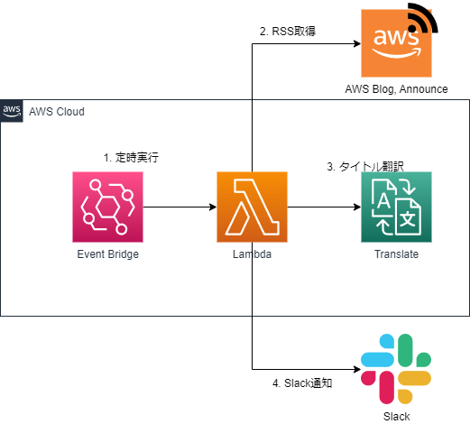

# AWSNews RSS Feed Slack

このCDKは、AWSのブログおよび最新情報の英語版RSSを取得し、
Amazon Tanslateでタイトルのみ日本語化してSlackへ通知するLambda、EventBridgeを構築します


対象の RSS は[AWS Blogs](https://aws.amazon.com/blogs/)の一部カテゴリと[What's New with AWS](https://aws.amazon.com/about-aws/whats-new/)です。  
対象の詳細は、src/lib/feed.tsに記載しています。

## アーキテクチャ




## デプロイ

### 1.Webhook URLの設定

SlackのWebhook URLはLambdaの環境変数として設定しています。
.envファイルはgitignoreしているので各自の環境で、CDKスタックの/libディレクトリ配下に.envファイルを作成し、下記を設定してください

- SLACK_INCOMING_WEBHOOK_URL="Slack Webhook URL"
- DRY_RUN="テストフラグ。値を設定した時有効、空の場合無効"
    - フラグが有効の時、タイトルの翻訳とSlack通知の処理がスキップされます。

### 2. デプロイ

```bash
$ cdk bootstrap // そのAWSアカウントで初実行時に実行
$ cdk deploy    // デプロイ
```
